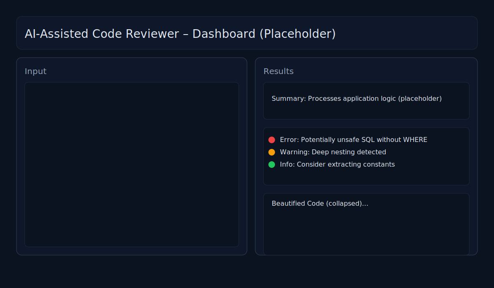
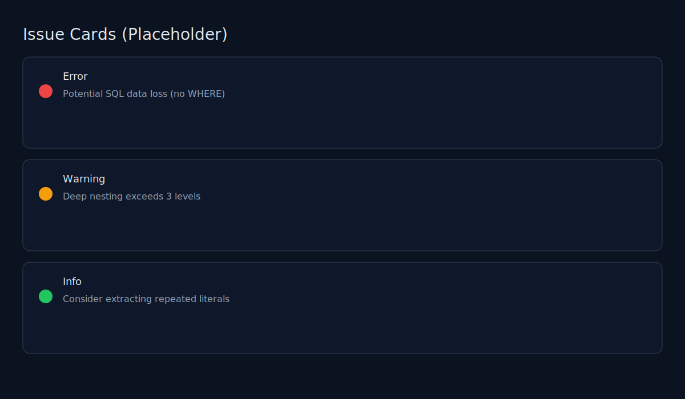
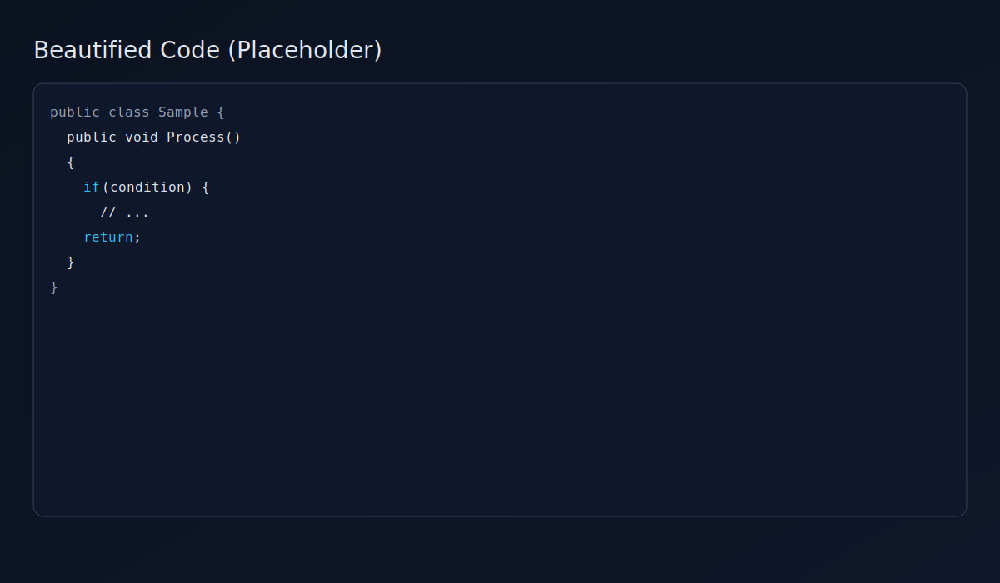

<div align="center">

# AI-Assisted Code Reviewer

Analyze code, detect issues, and enhance readability with a clean web UI or a simple console flow.

</div>

## Overview

AI-Assisted Code Reviewer is a lightweight .NET web/console tool that analyzes C#, VB.NET, and SQL code. It performs rule-based analysis, surfaces potential issues, checks naming quality, highlights common code smells, and beautifies code for easier reading. A concise summary describes what the code likely does.

The project is implemented in C# (.NET SDK 8.0+; tested with .NET 9) and ships with a minimal API plus a Tailwind-powered web UI. No external parsers or heavy frameworks are required—just the .NET SDK.

## Features

- Language detection (CSharp, VBNet, SQL)
- Rule-based analysis (selected examples)
	- C#: overly nested `if`, very long lines (>120 chars), `TODO` comments
	- VB.NET: `GoTo` usage, missing `End Sub` / `End Function`
	- SQL: `SELECT *`, `DELETE`/`UPDATE` without `WHERE`, `NOLOCK` usage
- Naming Quality Checker
	- Flags short/non-descriptive names (`ab`, `tmp`, `test`, `data`, `value`, `var`, etc.)
	- Variable names that are too short (except common loop indices like `i`/`j`)
	- Names starting with a number
- Code Smell Detector
	- Deep nesting (C#, VB.NET, SQL `BEGIN`/`END`)
	- Long parameter lists (>5)
	- Large classes / procedures (line and method count heuristics)
	- Repeated string/numeric literals (≥3) → suggest constants
- Summary Generator
	- One-sentence summary (≤120 chars) inferred from method/class names and SQL verbs
- Beautifier
	- Re-indents code with 4 spaces per level
	- Normalizes keyword casing (UPPERCASE for SQL; PascalCase hints for C#/VB)
- Web UI (Tailwind CSS + vanilla JS)
	- Responsive split layout (input left, results right)
	- Color-coded issue cards (Error/Warning/Info), icons, and transitions
	- Collapsible Beautified Code with Copy button
	- Loading spinners and friendly status messages

## How It Works

Core flow:

1. Language detection: `LanguageDetector.Detect(code)` → CSharp | VBNet | SQL
2. Summary: `SummaryGenerator.Generate(code, languageName)` → one sentence
3. Rule-based analysis: `CodeAnalyzerService.RunRuleBasedAnalysis(...)`
4. Naming checks: `NameQualityChecker.Analyze(code, languageName)` → issues
5. Code smells: `CodeSmellDetector.Analyze(code, languageName)` → issues
6. Beautify: `Beautifier.Beautify(code, languageName)` → formatted snippet

Minimal API endpoint (server mode):

- POST `/analyze` (JSON)

Request body:

```json
{
	"code": "// your code here"
}
```

Response (shape):

```json
{
	"summary": "Processes application logic.",
	"language": "CSharp",
	"issues": [
		{
			"type": "Smell.DeepNesting",
			"lineNumber": 8,
			"message": "Nested blocks exceed 3 levels.",
			"suggestion": "Refactor using early returns.",
			"severity": "Warning"
		}
	],
	"beautifiedCode": "// formatted code"
}
```

Notes:

- All checks are heuristic and intentionally lightweight (regex/string-based).
- This project does not call external AI services by default; “AI-Assisted” refers to the assistive analysis and UX.

## Running Locally

Prerequisites:

- .NET SDK 8.0 or newer (project tested with .NET 9 SDK)

Clone and build:

```powershell
git clone https://github.com/asifpeshkar/ai-code-reviewer.git
cd ai-code-reviewer
dotnet build
```

Run – console mode:

```powershell
# Analyze a file
dotnet run -- samples\sample.cs

# Analyze SQL sample
dotnet run -- samples\sample.sql

# Pipe from stdin (Ctrl+Z then Enter to end input in Windows PowerShell)
Get-Content samples\sample.cs | dotnet run --
```

Run – web UI (minimal API server):

```powershell
dotnet run -- --server
# Open http://localhost:5080 in your browser
```

Troubleshooting:

- If port 5080 is busy or an old process is locking the executable:

```powershell
# Free port 5080 and stop any leftover processes
$p=(Get-NetTCPConnection -LocalPort 5080 -ErrorAction SilentlyContinue | Select-Object -ExpandProperty OwningProcess -Unique)
if($p){ Stop-Process -Id $p -Force -ErrorAction SilentlyContinue }
Get-Process AICodeReviewer -ErrorAction SilentlyContinue | Stop-Process -Force

# Start server again
dotnet run -- --server
```

## Example Screenshots (placeholder)

> Replace these with real screenshots from `http://localhost:5080`.

- Dashboard – Input and Results
	- 
- Issue Cards – Color-coded Errors/Warnings/Info
	- 
- Beautified Code – Collapsible with Copy
	- 

## Credits

- Built by Asif Peshkar @ Nexum Software
- Technologies: .NET SDK (8/9), C#, Tailwind CSS
- Thanks to the .NET and Tailwind communities for great tooling and docs

---

If you have suggestions or want to extend the rule set (Roslyn analyzers, SQL parsers, etc.), feel free to open an issue or submit a PR.
# AI-Assisted Code Reviewer & Code Smell Detector (Scaffold)

This is a minimal scaffold for a console-based analyzer that:

- Accepts a code snippet (via file path argument or stdin)
- Detects language (C#, VB.NET, SQL)
- Runs a stubbed `CodeAnalyzerService` (rule-based, naming, smells)
- Prints Summary, Language, and Issues Found

Logic is intentionally stubbed; this is the initial structure to build upon.

## Run

Build and run:

```powershell
# from the repository root
dotnet build

# Run with a file path
dotnet run -- samples/sample.cs

# Run with SQL sample
dotnet run -- samples/sample.sql

# Paste code via stdin (press Ctrl+Z then Enter to finish in Windows PowerShell)
Get-Content samples/sample.cs | dotnet run --
```

## Project structure

- `Program.cs` – input/output wiring
- `Enums/DetectedLanguage.cs` – supported languages
- `Models/Issue.cs` – issue model
- `Models/AnalysisResult.cs` – analysis result model
- `Services/LanguageDetector.cs` – naive detector
- `Services/CodeAnalyzerService.cs` – stubbed analyzer
- `samples/` – example code files

## Next steps

- Implement real detection heuristics or use parsers
- Fill in rule-based analysis, naming checks, and code smells
- Add tests (xUnit) and CI
- Support more languages